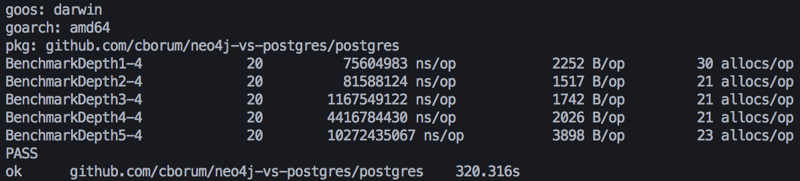
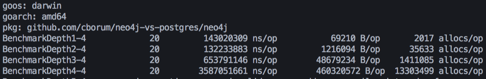

# Databases Assignment 9
## Describe the setup of your experiment. That is, what does someone has to do/install/setup to reproduce your experiment?
```bash
$ go get github.com/cborum/neo4j-vs-postgres
$ cd neo4j-vs-postgres
# while having postgres and neo4j running, matching the assignment setup
$ go test ./... -benchmem -bench=. -run=^a
```

## Present the execution time of each query each of the 20 random nodes/persons per database.
### Postgres

### Neo4j


## Present the average and the median runtime of each of the queries per database.

|Depth|Postgres|Neo4j|
|---|---|---|
|1|Average: 75604983 ns (0,07 sec.)|Average: 143020309 ns (0.14 sec.)|
|2|Average: 81588124 ns (0.08 sec.)|Average: 132233883 ns (0.13 sec.)|
|3|Average: 1167549122 ns (1.16 sec.)|Average: 653791146 ns (0.65 sec.)|
|4|Average: 4416784430 ns (4.41 sec.)|Average: 3587051661 ns (3.58 sec.)|
|5|Average: 10272435067 ns (10.27 sec.)| Didn't finish |

## Give an explanation of the differences in your time measurements.
The SQL (postgres) execution time seem to be growing exponentially, faster than the Neo4j result, although the the neo4j query depth 5, 20 times, didn't finish (took too long), which might have been a memory issue.

## Conclude which database is better suited for this kind of queries and explain why.
I would say that the queries are best suited for cypher since they look very readable, in contrast to the sql queries, that are way longer and unreadable, in my implementation. The relations in a graph database also makes more sense than the references and keys in SQL, in the way that you can directly name the relation between to entities. The bad side about this graph database is that it seem to require a lot of ram for faster queries as far as i know.